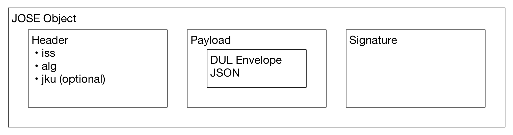
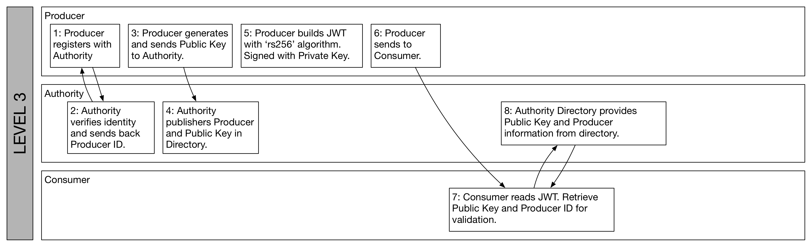
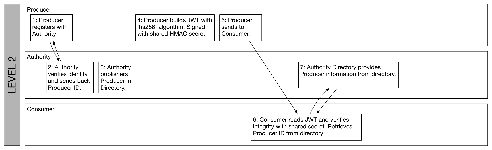
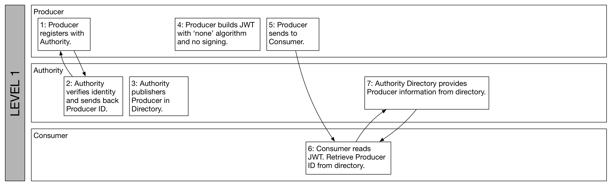
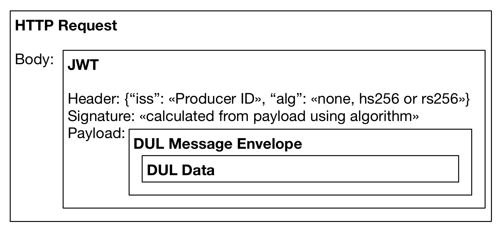

# Crossref Distributed Usage Logging Message Authentication Recommendation

Joe Wass jwass@crossref.org

Version 0.1 - First draft

## Introduction

DUL (Distributed Usage Logging) is a system that allows messages containing usage data to be sent from Producers to Consumers. DUL's Message Authentication mechanism enables Producers to share data with Consumers such that Consumers can be confident in the origin and integrity of the message.

The DUL Working Group has members from both the Producer and Consumer groups. Within both groups there is a diversity of requirements and priorities. This Recommendation establishes a baseline that allows Producers to indicate their identity when sending the message and allows Consumers to trust the identity of the sender and the integrity of the message.

For Producers who are not able to fully implement Message Authentication when sending messages, this Recommendation establishes two further levels of partial implementation.

For Consumers who are not able to fully implement Message Authentication when consuming messages, this Recommendation establishes a 'relaxed' mode (in addition to the default 'strict' mode) in which messages can be read but no authentication takes place.

This Recommendation aims to use open, popular standards, so that full implementation is convenient, straightforward and portable.

The following principles underpin DUL's Message Authentication strategy:

 - simplicity of implementation
 - portability of infrastructure
 - broad compatibility
 - flexibility where needed
 - ability to indicate the sender of a message
 - ability to establish the integrity of a message, i.e. to be confident that it has not been tampered with
 - ability to establish the authenticity of a message, i.e. to be confident who sent it
 - non-repudiation of a message, i.e. ability to demonstrate proof of the the integrity and authenticity
 - ability to delegate processing of messages on the Consumer side, or to make messages public without compromising the Message Authenticity framework
 - defence against replay attacks

The Working Group identified three levels of trust in the "DUL: proposed technical solutions for authentication" document:

 - A: Identification of message origin
 - B: Verification of message origin
 - C: Verification of message content

The Working Group identified four techniques for achieving the above. Numbers in brackets represent proposed options in the  document and letter represents trust level defined above:

 - Unique, public identifiers assigned to Sending parties by the Message Authentication Authority. (Option 1, trust level A)
 - Public Key Cryptography to enable Producers to sign messages in such a way that Consumers can be confident of integrity, authenticity and non-repudiation, and to protect against replay attacks. (Option 2c, trust level B)
 - Checksum to enable Producers to provide a means of checking (but not guranteeing) that the message was not accidentally tampered with. (Part of option 2c, trust level C)
 - An implementation with no form of integrity or authenticity checking. (Trust level C)

They also identified a technique whereby tokens can one-time signed by a Private Key and verified (Option 2a), but this approach was not sufficiently distinct from Option 2b.

This Recommendation comes with a simple reference implementation. The tool serves as a proof-of-concept, reference implementation for integration with existing systems, or as a stand-alone tool in production. See the Appendix.

### Roles in DUL

There are five roles involved in DUL:

 1. COUNTER - an organisation that defines the content of the DUL envelope. This is beyond the scope of this Message Authentication report.
 2. Crossref - an organisation that provides a mapping of DOIs to DUL endpoints via the DOI system.
 3. Message Authentication Authority - the organisation that provides the infrastructure for verifying authenticity. At the time of writing this is Crossref, but the role may be transferred to another party e.g. to COUNTER. Referred to as 'Authority' in the rest of this document.
 4. Producer - a party generating data and sending messages. These are organisations like hosting platforms.
 5. Consumer - a party receiving data. These are publishers (Crossref members) or their agents.

### Scope

The Message Authentication framework relates to the transport of a DUL Envelope and supporting infrastructure to enable Message Authentication. It does not concern the Message Envelope itself, or the contents of the envelope.

### Recommended Specification Abstract

DUL Message Authentication will be implemented using the JWT (JSON Web Tokens) family of specifications. JWT is a collection of pre-existing technologies and techniques that align very closely with the aims of DUL.

All DUL messages will be sent as a JWT with the JSON-serialized DUL message as the payload.

DUL provides three levels of Producer implementation (corresponding trust levels per 'techincal solutions' document):

 - Level 3: Identify message origin with token. Authenticity checks with RSA signing. This fulfils all of the security and authenticity objectives and is the most complete implementation. (Trust level C)
 - Level 2: Identify message origin with token. Checksum using HMAC. This gives an indication (but not proof) that the message was not accidentally changed in transit. This provides integrity but no authenticity checks. (Between trust levels A and C)
 - Level 1: Identify message origin with token. No integrity or authenticity checks.  (Trust level A)

Two levels of Consumer are defined:

 - Strict: Authenticity and integrity are validated. 
 - Relaxed: No checks for authenticity, origin or integrity. 

JWS (JSON Web Signature) is a part of the JWT specification. It defines how messages are signed. JWS defines algorithms for all three Producer Levels:

 - For Level 3 (default), the `rs256` algorithm is used.
 - For Level 2, the `hm256` algorithm is used to provide a checksum.
 - For Level 1, the `none` algorithm is used.

For Level 2, a well-known, public HMAC256 'secret' is defined. For Level 3, Producers create RSA Public / Private Key Pairs and sign their messages. The Authority operates a Public Key Server to host the public keys.

#### Producer Level 3 overview

#### Producer Level 2 overview

#### Producer Level 1 overview

# Discussion

## Producer Levels

For some Producers, or Consumers who rely on them, it is important that the sender and integrity of a DUL message can be reliably known. Level 3, the default level, provides this functionality.

Some Producers may perceive the overhead of using Public / Private Keys as too much of an implementation burden, but still wish to include a message digest to indicate whether or not the message has been accidentally tampered with en route.

Some Producers may be unable to apply any integrity or authentication verification to the message. The working group considered that this level of implementation to be important, and that participation in DUL was contingent on this option.

## Reliability of Integrity Checks at Level 2

The Integrity Check performed at Producer Level 2 is able to demonstrate that the message has not changed between the Producer and the Consumer. This gives some confidence to the Consumer that the message has not been accidentally altered with en route, and that the complete message has been received.

Level 2 does not guard against malicious interference because it is possible to tamper with the message and re-create the signature.

Both the Producer and the Consumer require access to the HMAC 'secret' in order to sign and validate respectively. Therefore any party with access to the 'secret' is able to maliciously tamper with the message and re-sign it. Because one of the aims of the Message Authentication specification is that Producer's messages may be shared with other parties, public or private, the 'secret' is published and known by all parties.

Level 2 doesn't provide protection against replay attacks or non-repudiation. For these features Level 3 is required.

## Reliability of Authenticity Checks at Level 3

Level 3 relies on Public / Private Keys to sign the message. A full discussion of Public Key Cryptography is beyond the scope of this document.

Every Producer has a Public / Private keypair. According to the principles of Public Key Cryptography, the message is signed by the private keypair and the Public key of every Producer is published and known to all parties. Any consumer is able to use the Public key to verify that the holder of the corresponding private key, and only the holder of that key, signed the message. This allows for non-repudiation.

## Consumer Levels

Similarly, for some Consumers, the integrity and authenticity of the message was important, and for some it was not. Therefore, the 'strict' default Level allows Consumers to be confident of the integrity and/or authenticity of messages they receive.

The 'relaxed' Level allows Consumers to read DUL messages but not to make any guarantees of integrity or authenticity.

## Compatibility between Levels

Because Level 1 provides no guarantee of integrity or authenticity, it is not possible for a Consumer operating at 'strict' Level to consume these messages (although they may downgrade to 'relaxed' to do so).

Because Level 2 provides an indication of integrity and Level 3 provides a guarantee of integrity and authenticity, they may both be consumed by Consumers operating at the 'strict' Level.

| Producer | **Strict Consumer**       | **Relaxed Consumer**    |
|----------|---------------------------|-------------------------|
| **P 1**  | Cannot read.              | Read with no validation. |
| **P 2**  | Read and check integrity. | Read with no validation|
| **P 3**  | Read and validate integrity and authenticity. | Read with no validation |

### Applicability of JWT

The JWT family of technologies, formally JOSE (JavaScript Object Signing & Encryption) defines a few components:

 - JWT - JSON Web Token - a format for serialising data
 - JWS - JSON Web Signature - a standard for signing (with HMAC or RSA) JWTs
 - JWK - JSON Web Key - a standard for representing Public / Private Keys

A JWT contains a header, which contains information about the message, a payload (which is the DUL envelope), and a signature, which is used to verify the integrity and/or authenticity.

The JWT's JOSE header contains an `iss` field. This indicates the Producer ID. As the DUL envelope is sent as the JWT Payload, none of the standard JWT claims are used.

JWS defines a number of algorithms to produce and verify signatures, including a special 'none' algorithm. The `none` algorithm is used for Level 1, `HS256` is used for Level 2 and `RS256` for Level 3.

The aim at Level 2 is to provide a checksum which enables the Consumer to check that the message didn't change in transit. JWS provides no simple checksum feature, so HMAC is used, along with a published shared secret. Because Level 2 uses a symmetric secret for HMAC signing, both producers and consumers must know the 'secret', which is defined in the specification. Therefore Level 2, as discussed above, cannot be used to guarantee against malicious tampering.

JWS defines a `jku` (JWS Key URL) field in the JWS header. This is a URL that holds the Public Key that was used to sign the message. Producers create these keys and sending them to the Authority. The Authority encodes the Producer ID in the URL and ensures the identity of the Public Key sender.

An example URL:

    https://dul-token.crossref.org/tokens/jwk/producer-1234/example.json
    \_____________ Whitelisted Prefix ______/\_ Producer _/\_ Keyname _/

The Authority is responsible for storing and serving these JWK keys.

The Recommended DUL Message Authentication Specification stipulates that the URL must be match a specified prefix, to ensure that only JKUs issued by the  Authority can be accepted.

Furthermore, the Producer ID must be included are a prefix of the ID, and this must match the `iss` field in the JWS header.

## Specification

The Specification section is normative. A non-normative reference implementation is provided, see the Appendix.

### Supplementary

1. Whitelist URL: "https://dul-token.crossref.org/tokens/jwk/"
2. HMAC256 'secret': "dul-77d343c3-f8e8-48d9-9e14-1e52aa8611e8"

### Functional Specifications

1. Every Producer MUST be registered with the Authority, and will be issued a Producer ID.
  1. The Producer ID MUST be unique.
  2. The Producer ID MUST be URL-Safe and have a length greater than 1 character.
  3. The Producer ID MAY be made public.
2. Every Producer MUST operate at Level 1, 2 or 3. This choice is made when for each message sent and can be made or changed at any time.
3. If a Producer wishes to implement Level 3, they Producer MUST create one or more Public/Private Keypairs.
  1. Each Keypair MUST be in the JWK format.
  2. Each Private Key MUST be kept secret by the sender.
  3. Each Public Key MUST be sent to the Authority.
  4. The Authority MUST verify the correct identity of the Provider when it sends keys.
  5. The Authority MUST publish the JKU on the web at a JKU URL.
  6. The JKU URL MUST have a prefix of the whitelisted base prefix concatenated with the provider ID.
  7. The Authority MUST send a the JKU URL back to the Provider.
4. The Authority MUST maintain an open directory of Producer IDs.
  1. The directory of Producer IDs MUST be public and available at a well-known URL.
  2. The directory MUST be in machine-readable format.
  3. The directory MUST enumerate all Producer IDs.
  4. Producer IDs MUST not be removed from the directory, but they MAY have the 'removed' flag set.
  5. Producer IDs MUST be mapped to the verified name of the organisation and a contact email address.
5. The Authority MUST maintain an open directory of Public Keys.
  1. Each Key MUST contain only the Public Key component, not the Private Key component.
  2. The Producer ID, as indicated in the URL, MUST correspond to the Producer ID in the Producer ID Directory.
  3. The Authority MUST take responsibility for verifying the identity of the Producer when a key is sent.
  4. When a JKU is published at a URL, it MAY be subsequently deleted.
  5. When a JKU is published at a URL, the content MUST NOT be subsequently changed.
6. Every DUL message MUST be sent as a JWT.
  1. Every message MUST have the `iss` field in the JOSE header.
  2. The value of the `iss` field MUST be the Producer ID.
  3. Every message MUST include an `alg` field.
  4. The `alg` field MUST have a value of `none`, `hm256` or `rs256`.
    1. An `alg` value of `none` signifies Level 1.
    2. An `alg` value of `hm256` signifies Level 2.
    3. An `alg` value of `rs256` signifies Level 3.
    4. Producers SHOULD use Level 3 but MAY use Level 1 or 2.
7. If the `alg` field value is `none`, no JWS signature is required.
8. If the `alg` field value is `hm256`:
  1. The message MUST be signed using the `hm256` algorithm.
  2. The published HMAC256 'secret' MUST be used to create the signature.
9. If the `alg` field is `rs256`:
  1. The message MUST be signed using the `rs256` algorithm.
  2. The Provider's JWK MUST be used to sign the message.
  3. The Provider MUST have sent the JWK to the Authority before signing the message.
  4. The Provider MUST include the `jku` field in the JOSE header with the value of the URL provided by the Authority.
  5. The JWK used to sign the key MUST correspond to that provided in the `jku` field.
10. A Producer MAY accept only JWT messages for DUL.
11. JWTs received MAY be assumed to conform to the above specifications.
12. Consumers MUST act in either 'strict' mode or 'relaxed' mode. This choice MAY be made per message.
13. In 'relaxed' mode:
  1. Consumers MUST discard the JWS signature and JWS `alg` field.
  2. The `iss` header MUST be present and have a length greater than 1 to pass validation.
  3. The JWT Payload can then be decoded as normal according to the JWT spec.
14. In 'strict' mode:
  1. The `iss` header MUST be present and have a length greater than 1 to pass validation.
  2. The `alg` header MUST be present and one of `rs256` or `hm256` to pass validation.
  3. If the `alg` header value is `hm256`:
     1. The published HMAC256 secret MUST be used to verify the message.
     2. HMAC256 validation MUST succeed to pass validation.
  4. If the `alg` header value is `rs256`:
     1. The header MUST contain the `jku` field.
     2. The value of the `jku` field MUST have the prefix of the published whitelist URL.
     3. The value of the `jku` field MUST have the prefix of the published whitelist URL concatenated with the value of the `iss` field.
     4. The Consumer MUST download the JKU at the specified URL.
     5. The Consumer MAY cache the response of the JKU URL indefinitely.
     6. Validation of the JWS MUST pass using the JKU.

## Further Reading

### JWT.io

http://jwi.io contains extensive information about background and implementing JWT.

### JWT Book

 - Sebastian E. Peyrott, Auth0 Inc.
 - Version: 0.10.1, 2016
 - Available at: https://auth0.com/e-books/jwt-handbook

### DUL: proposed technical solutions for authentication

 - DUL Working Group
 - Version: November 29 2016, 11:55 AM

### IETF RFC 7519: JSON Web Token (JWT)

https://tools.ietf.org/html/rfc7519

### IETF RFC 7515: JSON Web Signature (JWS)

https://tools.ietf.org/html/rfc7515

### IETF RFC 7517: JSON Web Key (JWK)

https://tools.ietf.org/html/rfc7517

### JOSE Docs

http://jose.readthedocs.io/en/latest/

### Distributed Usage Logging: a report on Stakeholder Demand

Information Power
October 2016

## Appendix

### Reference Implementation

A reference implementation is provided at [https://github.com/CrossRef/dul-tool](https://github.com/CrossRef/dul-tool). It contains a full implementation of the Specification, plus implementation notes.

The [Nimbus JOSE library and tools](http://connect2id.com/products/nimbus-jose-jwt) are a good reference for JOSE and JWS. The DUL reference implementation is a thin wrapper around this.

## Discussion of Alternative Solutions Considered

### PGP-Signed Messages

PGP is an open source encryption and authentication framework that uses Public / Private Keys. It a popular tool for signing emails. It relies on a web of trust for establishing trust between the Provider and Consumer.

The principles behind PGP are very similar do DUL, but JWT provides a simpler implementation.

### Opaque Tokens

This was the first approach taken by the DUL Working Group, and it spurred conversation around issues of spoofing, replay and non-repudiation. An opaque token sent with a message is able to indicate the sender of the message, but no more. It can be re-used by another party by attaching it to another message. Note that this is Producer Level 1 is implemented, except the token is sent in the unsigned JOSE header as `iss`.

## Q&A

### Why not just use JWT in HTTP headers?

JWTs are commonly used in the role of authentication tokens. However, in the DUL role they are typically used as a container for claims (e.g. "I am able to perform this action"). The aim of DUL Message Authentication is twofold: firstly to provide information about the message and secondly to provide information about the sender.

It is conceivable that JWTs as HTTP header tokens could be used in this second role: a Provider could issue a JWT that identifies themselves in a manner that guarantees it was generated by the sender. However, this would only do half the job, as it would not take into account the content of the message. Furthermore, it would not provide non-repudiation as replay attacks would be possible (i.e. some malicious party takes the token and uses it to send another message).

To fulfil the first role, that of message integrity, a content hash would have to be taken and included as a claim in the JWT. This would provide message integrity validation, but would be solving the problem by re-inventing a core part of JWS functionality. It would also add implemenation complexity.

In order to take message content into account, the message would have to be included in the JWS. This is in fact what happens in Level 3: the whole DUL message is taken as the JWT payload, and the whole JWT is sent.

### Can I just send JSON?

Sending JSON in the body of the message and then attaching some kind of checksum in the header would be possible, but more complicated to implement. JWT provides a convenient package, and the Specification allows for flexibility of requirements.

As indicated in 'Why not just use JWT in HTTP headers?', Level 1 allows for the JSON content to be packaged as a JWT and sent without any integrity or authentication features.

Allowing two encoding formats, JWT for Levels 2 and 3 and plain JSON for Level 1 might seem simple, but it would increase the amount of work a Consumer would have to do to negotiate the type of content they are dealing with. Uniformity is a design goal.

At both Producer and Consumer side, the software libraries to create and work with JWTs are as simple to use as the libraries for working with JSON.

### Why not use HTTP headers as a general approach?

HTTP headers were considered as an earlier proposal for source tokens. It was suggested that both the Producer ID and content integrity could be supplied via HTTP headers.

JWT encapsulates the concept of header, body payload and signature, similar to an HTTP message. JWT has some advantages:

 - a JWT has built-in JWS signing as a default. This means that semantics about how to use headers are well-defined.
 - a JWT is encapsulated as a single object. This means that a JWT can be stored for processing later, transmission to another party, or as part of an audit chain.

Furthermore, in order to securely identify the sender of the message, the Producer ID must be included in the signed message. If the signature were stored in an HTTP header then this would not be possible. With JWT, the headers are included in the signature.

### Why is the Producer ID stored outside the DUL Envelope?

The current Envelope Spec includes the 'source token' field to indicate the sender. In order to produce a specification that allows for all three levels, the JWT must contain the producer's ID at a level accessible to the verification process (so that Level 3 checks can whitelist the Public Key URL supplied with the `jku` field).

The committee may wish to refine the Envelope specification to remove the `source token` field as, if this recommendation is accepted, that information will already be included as the JWT header.

### Why send the DUL message as the whole JOSE payload? Why not embed as a JWT 'private claim'?

The 'iss' claim is provided in the JOSE header, not the payload (as is conventional with JWT), so there is no need for Authentication to look in the payload.

Allowing the message to be included as the literal payload allows implementers to completely decouple their envelope parsing from their JWT verification, if they want to. They may use whatever JSON libraries they want to parse the payload, and may opt not to parse immediately, and to store for later. This decoupled approach brings the greatest compatibility and flexibility for implementation.

It also allows for an arbitrary payload to be sent. If in future the DUL Working Group decided that XML or YAML was the format for DUL, no changes would need to be made to the Authentication mechanisms.

In theory the payload could be embedded as a private claim, but it would either have to be a JSON object as a string, which would complicate implementation, or as first-class objects in the JWT claim, which would couple the Authentication with the DUL business logic.

### Why use HMAC for checksum?

JWS provides two kinds of algorithms (RFC 7581 §3.1): checksum based (HMAC), and Public / Private key based (RSA and ECDSA). There is no simple 'checksum' algorithm, largely because of the fact that it provides no security. For this reason, HMAC coupled with a known shared secret is the best fit.

### Why is the HMAC secret public?

HMAC is a symmetrical algorithm: the secret used to sign the payload must be known both to the Producer and Consumer. Therefore it must be made known to all Producers and all Consumers. The DUL Working Group identified the need to be able to share DUL messages with third parties or even make them known publicly. This would further broaden the audience who would need to know the secret.

Keeping the secret confidential under these circumstances would constitute 'security by obscurity', which is a well known way of achieving no security whatsoever. For this reason, it is better to publish the secret and make it well known.

This does mean anyone can sign a DUL message. Therefore Level 2 protects message integrity against accidental damage, but not against intentional bad actors. For this we have Level 3, which is the recommended Level.

### Why allow insecure communication at Level 1?

For some members of the Working Group, implementing integrity and authenticity is was a blocker. Therefore to ensure the broadest participation, Levels 1 and 2 were introduced.

### How does this ensure that only the specified sender is who they say they are?

The JKU URL prefix ensures that only Producers who are DUL members can sign messages. This is coupled with the Producer ID included in the URL to uniquely identify the Producer Id. The Authority only issues JKU URLs to verified Producers.

### Why three levels of Producer only two levels of Consumer?

Having three levels of Producer and three levels of Consumer would not necessarily make three symmetrical levels.

The three Producer levels are based on ability to implement the standard, but the three Consumer levels are based on business requirements with regards to authentication.

Having three levels of Consumer based the three levels (none, integrity and authenticity) would produce a compatibility matrix something like:

|                | **Consumer 1**        | **Consumer 2**         | **Consumer 3**       |
|----------------|-----------------------|------------------------|----------------------|
| **Producer 1** | YES. Can read.        | YES. Can read.         | YES. Can read.       |
| **Producer 2** | NO. Cannot read HMAC. | YES. Can verify HMAC.  | YES. Can verify HMAC.|
| **Producer 3** | NO. Cannot read RSA.  | NO. Cannot read RSA.   | YES. Can verify RSA. |

In this case, the higher the Consumer Level, the more input can be read. However, the level of security still depends on the Producer Level: a Level 3 Consumer could read a Level 1 message, but that would not make it trustworthy.

Having a simple "validate input" or "don't validate input" more closely aligns business cases for Consumers.

### When should messages be verified?

Messages should be verified on receipt, or soon after. If a Public Key is removed from the directory, a message that makes reference to it cannot be validated.

If Consumers wish to store messages and validate them a significant time after they are issued, they are welcome to download and store JWKs from the JKU URLs. This requires a custom implementation, but not a complicated one.

### My organisation already issues Public Keys. Should they be reused?

No, we recommend you create dedicated keys for DUL. This allows you to manage them without coupling your DUL implementation to any other infrastructure that may use them.

### Why not use keybase.io

DUL Public Key verification requires two things: for the keys to be published and for the producers to be verified as DUL members and kept in a directory.

The Recommendation describes a very simple key server where the Authority acts as a registry for looking up keys. Because DUL keys are special-purpose, simple key server architecture suits our needs. Whichever service were used for serving Public Keys, the Authority would still need to operate the directory of DUL providers.

Involving an external party would create a dependency of infrastructure which would introduce another point of failure and limit portability.

### How widespread is JWT support?

JWT has wide support, with a large number of software libraries. They are listed at [https://jwt.io/](https://jwt.io/).

### Is the authentication format future proof?

As far as can be. The JWT and JOSE specifications are based on JSON, and are therefore very flexible and extensible. This specification leaves room for further levels of validation and new algorithms in a future version.

### Can I use other signing algorithms?

No. For broadness of compatibility, we recommend only the specified algorithms. Future versions of DUL may use new algorithms by consent of the working group.

### How does DUL deal with key revocation and expiry?

Keys can be removed from the public server by request of the Producer. They may be cached by the Consumer. They do not include expiry dates.

The DUL model trusts the good faith and direct communication between both Producers, Consumers and the Authority (whilst providing guarantees).

### Would it be more efficient to use a Root Certification Authority and X.509?

An alternative architecture would be to establish the Message Authentication Authority as a Root Certificate Authority à la X.509 and using a certificate chain. JWS does have support for X.509, so this is possible in theory. Using a certificate chain would establish that the Producer was authorised to send DUL messages, and the authenticity of the sender.

To compare the procedure in an X.509 world with the Recommendation:

X.509:

 - Message Authentication Authority distributes root certificate to all Consumers
 - Producer makes Key Pair
 - Producer makes a certificate
 - Producer sends a Certificate Signing Request to Message Authentication Authority
 - Message Authentication Authority sends back a Certificate Chain
 - Producer hosts Certificate Chain on their server
 - Message Authentication Authority makes Root Public Certificate available to Consumers
 - Consumer recieves message
 - Consumer retrieves X.509 certificate
 - Consumer follows certificate chain to verify chain of trust back to root CA (Message Authentication Authority)
 - Consumer uses Public Key from certificate to validate message

Recommendation:

 - Producer makes a Key Pair
 - Producer sends Key Pair to Message Authentication Authority
 - Message Authentication Authority sends back a JKU URL
 - Producer sends message
 - Consumer follows JKU to retrieve Public Key
 - Consumer uses JWK from JKU to validate message

X.509 is useful in the following circumstances:

 1. a certificate (which can carry other information) is needed
 2. there is a need to be able to trust more than one Root Certification Authority in an environment where multiple intermediary Certification Authorities can operate
 3. the Root Certification Authority, the Consumer and the Producer do not directly co-ordinate with one another

None of these apply to DUL Authentication:

 1. no extra information is required (Producer ID is communicated in the JWT and verified with a whitelist)
 2. only one Authority is required, as the Authority (Crossref) is the only party overseeing DUL
 3. the Authority, the Producers and Consumers are in close co-ordination: the Producers must register with Crossref and the Consumers are members of Crossref.

X.509 is more complex and provides no benefits for the DUL use case.

### Why use JKU? Why not just ship all the Public Keys to all Consumers?

This approach would be valid, but would take more effort and co-ordination. It would require Consumers to keep their key store in sync with the Authority: Consumers would have to check with the Authority for updates to the key set whenever a key unknown to them was used, or for the key set to be downloaded on a regular basis.  It would also require all Consumers to download all keys when they might not need them.

Instead, using JKUs, the keys are downloaded only when needed, and automatically. They can be cached to avoid having to re-fetch them. The specification stipulates that once keys are published at a URL they are immutable (although they can be removed).

### Is signature stripping possible?

Signature stripping is the process of taking a payload, maliciously altering it, and re-signing.

Level 3 signing requires the Producer to sign the message with their private key, which is known only by them. Therefore it is not possible for a malicious party to to re-sign the message using a fraudulent key.

Furthermore, the URL whitelist prevents fraudulently signed messages from non DUL-members from passing validation.

### Is this vulnerable to common JWT attacks?

Security at Level 1 is quantified, and Level 2 (where signature stripping is possible) is not allowed in 'strict' Consumer mode. You can read about [past JWT vulnerabilities here](https://auth0.com/blog/critical-vulnerabilities-in-json-web-token-libraries/).
